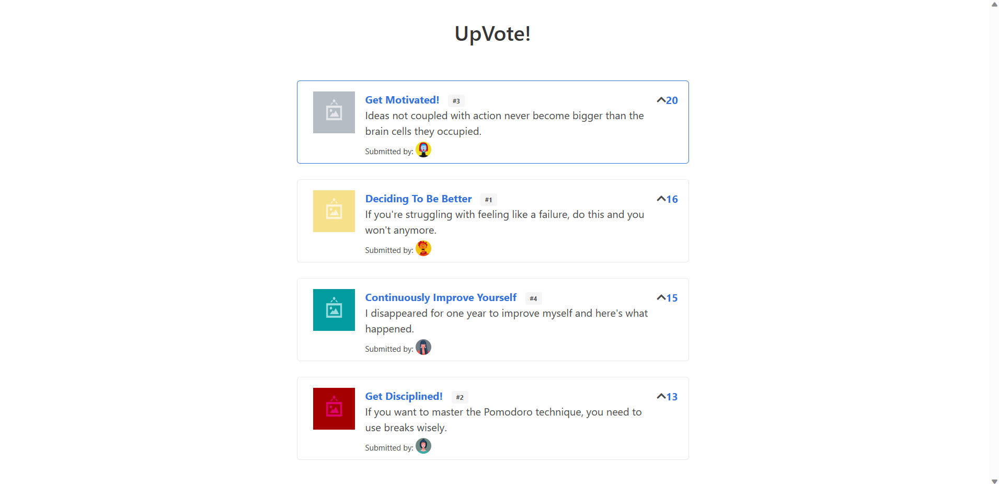

<a name="readme-top"></a>
<!-- TABLE OF CONTENTS -->
<details>
  <summary>Table of Contents</summary>
  <ol>
    <li>
      <a href="#about-the-project">About The Project</a>
      <ul>
        <li><a href="#built-with">Built With</a></li>
      </ul>
    </li>
    <li>
      <a href="#getting-started">Getting Started</a>
      <ul>
        <li><a href="#prerequisites">Prerequisites</a></li>
        <li><a href="#installation">Installation</a></li>
      </ul>
    </li>
    <li><a href="#key-features">Key Features</li>
    <li><a href="#usage">Usage</a></li>
    <li><a href="#contact">Contact</a></li>
  </ol>
</details>

<p align="center">
    
</p>

# About The Project
A simple voting application that takes inspiration from popular social feed websites like <b><i>Reddit</i></b> and <b><i>Hacker News</i></b>. It's based on chapter 2 of the book "<b><i>Fullstack Vue 3</i></b>"".

## Built With
* [![HTML5][HTML5-shield]][HTML5-url]
* [![CSS3][CSS3-shield]][CSS3-url]
* [![JavaScript][JavaScript-shield]][JavaScript-url]
* [![Vue.js][Vue.js-shield]][Vue.js-url]
* [![Bulma][Bulma-shield]][Bulma-url]
* [![Font Awesome][Font Awesome-shield]][Font Awesome-url]

<p align="right">(<a href="#readme-top">back to top</a>)</p>

# Getting Started

## Prerequisites
Before cloning and using this application, you'll need to install these things on your computer:
* [Visual Studio Code](https://code.visualstudio.com/download): You can choose any IDE or Text Editor that you want. To build a simple application like this, I recommend <b>Visual Studio Code</b>.
* [Live Server](https://marketplace.visualstudio.com/items?itemName=ritwickdey.LiveServer): An extension for Visual Studio Code that help to launch a local development server with live reload feature for static & dynamic pages.

## Installation
You can install this application by cloning this repository into your current working directory:
```sh
git clone https://github.com/theEmperorofDaiViet/upvote.git
```
After cloning the repository, you can open the project by Visual Studio Code.

Click to <code>Go Live</code> from the status bar to turn the server on/off.

As usual, the app should automatically open in a new tab in your browser. It runs on port 5500 by default.

<p align="right">(<a href="#readme-top">back to top</a>)</p>

# Key Features
UpVote! focuses on displaying a list of submissions that users can vote on:
* Each submission will present some information about itself like an image, title, and description.
* All submissions are sorted instantaneously by number of votes: submissions with the highest number of votes appear at the top of the web page with lower voted submissions being positioned at the bottom.
* The up-vote icon in each submission will allow users to increase vote numbers and subsequently rearrange submission layout
* A special blue border will appear around a submission when said submission reaches a certain number of votes (let’s say 20 votes)

<p align="right">(<a href="#readme-top">back to top</a>)</p>

# Usage
Our app looks like this:

<p align="center">
    
</p>

<p align="right">(<a href="#readme-top">back to top</a>)</p>

# Contact

You can contact me via:
* [![GitHub][GitHub-shield]][GitHub-url]
* [![LinkedIn][LinkedIn-shield]][LinkedIn-url]
* ![Gmail][Gmail-shield]:&nbsp;<i>Khiet.To.05012001@gmail.com</i>
* [![Facebook][Facebook-shield]][Facebook-url]
* [![Twitter][Twitter-shield]][Twitter-url]

<br/>
<p align="right">(<a href="#readme-top">back to top</a>)</p>

<!-- MARKDOWN LINKS & IMAGES -->
<!-- Tech stack -->
[HTML5-shield]: https://img.shields.io/badge/html5-%23E34F26.svg?style=for-the-badge&logo=html5&logoColor=white
[HTML5-url]: https://www.w3.org/html/
[CSS3-shield]: https://img.shields.io/badge/css3-%231572B6.svg?style=for-the-badge&logo=css3&logoColor=white
[CSS3-url]: https://www.w3.org/Style/CSS/
[JavaScript-shield]: https://img.shields.io/badge/JavaScript-323330?style=for-the-badge&logo=javascript&logoColor=F7DF1E
[JavaScript-url]: https://www.ecma-international.org/
[Vue.js-shield]: https://img.shields.io/badge/vuejs-%2335495e.svg?style=for-the-badge&logo=vuedotjs&logoColor=%234FC08D
[Vue.js-url]: https://vuejs.org/
[Bulma-shield]: https://img.shields.io/badge/Bulma-00D1B2?style=for-the-badge&logo=Bulma&logoColor=white
[Bulma-url]: https://bulma.io/
[Font Awesome-shield]: https://img.shields.io/badge/Font_Awesome-339AF0?style=for-the-badge&logo=fontawesome&logoColor=white
[Font Awesome-url]: https://fontawesome.com/

<!-- Contact -->
[GitHub-shield]: https://img.shields.io/badge/github-%23121011.svg?style=for-the-badge&logo=github&logoColor=white
[GitHub-url]: https://github.com/theEmperorofDaiViet
[LinkedIn-shield]: https://img.shields.io/badge/linkedin-%230077B5.svg?style=for-the-badge&logo=linkedin&logoColor=white
[LinkedIn-url]: https://www.linkedin.com/in/khiet-to/
[Gmail-shield]: https://img.shields.io/badge/Gmail-D14836?style=for-the-badge&logo=gmail&logoColor=white
[Facebook-shield]: https://img.shields.io/badge/Facebook-%231877F2.svg?style=for-the-badge&logo=Facebook&logoColor=white
[Facebook-url]: https://www.facebook.com/Khiet.To.Official/
[Twitter-shield]: https://img.shields.io/badge/Twitter-%231DA1F2.svg?style=for-the-badge&logo=Twitter&logoColor=white
[Twitter-url]: https://twitter.com/KhietTo